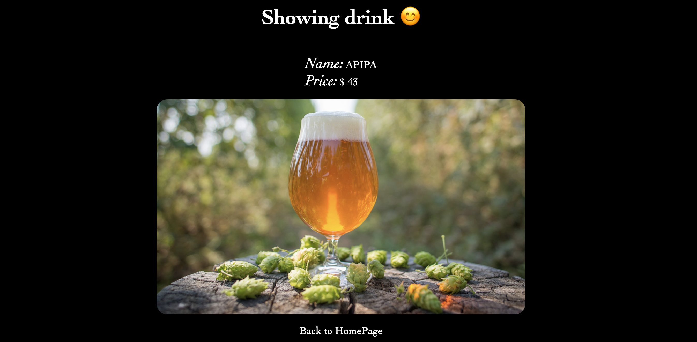

# GitPub

GitPub is a web application that helps users discover the latest drinks available at pubs for the sober curious. With GitPub, users can browse a list of drinks available at the pub, view details about each drink, and more!

## Features

- Index of all the drinks available at the pub
- Clickable drink names that take users to each drink's show page
- Show page that displays the name, image, and price of each drink

## Getting Started

To get started with GitPub, follow these steps:

1. Clone this repository to your local machine
2. Install the necessary dependencies by running `npm install`
3. Start the server by running `npm start`
4. Open your web browser and go to `http://localhost:3000/drinks` to view the list of drinks

## Dependencies

GitPub uses the following dependencies:

- Express
- EJS
- Body-parser
- Nodemon (devDependency)

## Contributing

If you'd like to contribute to GitPub, please follow these steps:

1. Fork this repository
2. Create a new branch (`git checkout -b feature/my-new-feature`)
3. Make your changes and commit them (`git commit -am 'Add some feature'`)
4. Push your changes to your forked repository (`git push origin feature/my-new-feature`)
5. Create a new pull request

## License

This project is licensed under the MIT License - see the [LICENSE.md](LICENSE.md) file for details.

## Acknowledgments

- The latest trend in food and drinks for inspiring this project!
- [Bootstrap](https://getbootstrap.com/) for providing a great UI framework.
